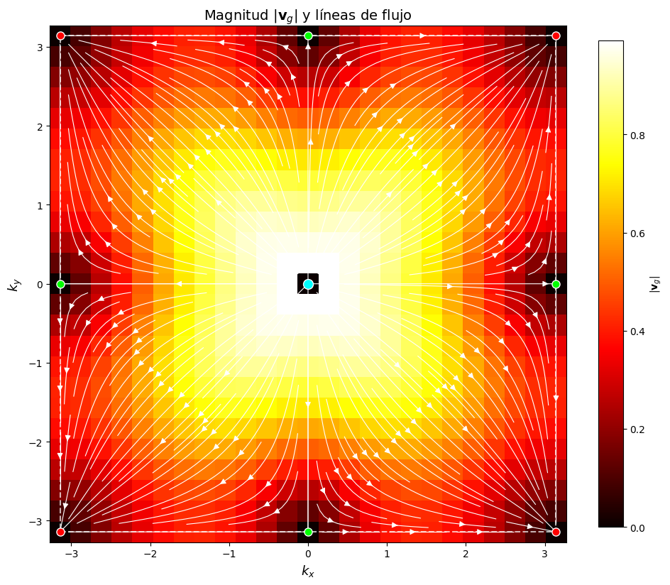
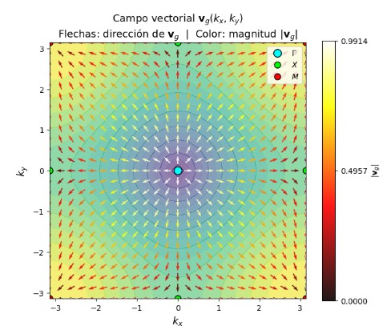

# Numerical Simulation of Phononic Modes and Density of States (DOS) in a 2D Crystal Lattice
I WILL INCLUDE A SUMMARY OF THE WORK, THE PROBLEM, THE RESULTS, AND THE CONCLUSIONS REACHED.

## Project Components
* **Theoretical Solution:** Analytical formulation of the vibration of a two-dimensional monoatomic lattice in the First Brillouin Zone.

* **Numerical Calculation:** Implementation in Python using NumPy and SciPy to solve eigenvalue problems in the First Brillouin Zone.

* **Data Visualization:** High-quality plots of the phononic branches and the numerical versus analytical DOS (Van Hove Singularities) using Matplotlib.

---

## Theoretical Resolution
**Equation of Motion**
To find the equation of motion, we will use Newton's laws. Let $U_n(t)$ be the scalar longitudinal displacement. Considering the lattice in 2-D, there will be a displacement with a horizontal component $n_x$ and a vertical component $n_y$. Therefore, we will consider the neighbors (below, above, to the left, and to the right) of the atom at position $U_n$.
Since each atom interacts via a spring (an interpretation of a reciprocal lattice), each atom exerts a restoring force and a buoyant force, as described by Hooke's Law.

$$F = -K \Delta X$$

Given the forces that arise during a 2-D network vibration, we can use
$$\sum F = ma$$  

where, by equating using Newton's third law, we can find the total forces of the 2D crystal lattice.

The equation of motion for a classical two-dimensional square lattice.
$$\sum F = m \frac{d^2 u_n}{dt^2} = K \left[ U_{n_x+1, n_y} - U_{n_x, n_y} + U_{n_x-1, n_y} - U_{n_x, n_y} + U_{n_x, n_y-1} - U_{n_x, n_y} + U_{n_x, n_y+1} - U_{n_x, n_y} \right]$$

**Since we are working with a periodic network, we can propose a Bloch wave as a solution:

$$ U_n(t) = A e^{i(\vec{k} \cdot \vec{R}_n - \omega t)}$$

where, by operating on the previously obtained equation of motion, we can find the dispersion relation. The dispersion relation for 2-D network vibration is defined as:

$$ \omega(k_{x}, k_{y}) = \sqrt{\frac{4K}{m} \left[ \sin^2\left(\frac{k_x a}{2}\right) + \sin^2\left(\frac{k_y a}{2}\right) \right]}$$

Dispersion in the first Brillouin zone
Based on the 1-D case, the first Brillouin zone would be $-\frac{\pi}{a} < k \leq \frac{\pi}{a}$, which for the 2-D case $k_x$ and $k_y$ gives us:

$$ -\frac{\pi}{a} < k_x \leq \frac{\pi}{a} \quad , \quad -\frac{\pi}{a} < k_y \leq \frac{\pi}{a}$$

This is consistent since this lattice is square in reciprocal space.

high symmetry points $\Gamma$ , $X$ and $M$.

In the case of $\Gamma = (0,0) = (k_x=0, k_y=0)$

$$\omega(k_x, k_y) = \omega(0,0)$$ 

$$\omega(0,0) = 0 $$ 

When $X = (\pi/a, 0)$: 

$$\omega(\pi/a, 0)= \left[ \frac{4K}{m} \left( \sin^2\left(\frac{\frac{\pi}{a} a}{2}\right) + \sin^2(0) \right) \right]^{1/2} $$

$$ = \left[ \frac{4K}{m} \left( \sin^2\left(\frac{\pi}{2}\right) + 0 \right) \right]^{1/2}$$ 

$$ = \left[ \frac{4K}{m} (1) \right]^{1/2} = \sqrt{\frac{4K}{m}} $$ 

Case $M = (\pi/a, \pi/a)$: 

$$\omega(\pi/a, \pi/a) = \left[ \frac{4K}{m} \left( \sin^2\left(\frac{\frac{\pi}{a} a}{2}\right) + \sin^2\left(\frac{\frac{\pi}{a} a}{2}\right) \right) \right]^{1/2}$$ 

$$\omega(\pi/a, \pi/a) = \left[ \frac{4K}{m} (1 + 1) \right]^{1/2} = \sqrt{\frac{8K}{m}}$$ 

In figure 1 we can see the dispersion relationship in the first brioullin zone, reflected The points of high symmetry in the lattice. When working with a periodic lattice, only the first zone is considered, since the other zones are analogous (periodic).

**Vector Group Velocity and Discussion of its Anisotropy**

The group velocity is defined as:

$$ V_g(k) = \nabla_k \omega(k) = \left( \frac{\partial \omega}{\partial k_x}, \frac{\partial \omega}{\partial k_y} \right)$$

In this section, the dispersion relation is used, and the paracillary differentiation is applied with respect to each k, resulting in:

$$ V_g(\vec{k})= \frac{a \sqrt{\frac{K}{2m}} [\sin(k_x a) \hat{x} + \sin(k_y a) \hat{y}]}{\sqrt{2 - \cos(k_x a) - \cos(k_y a)}}$$

Where $v_s = a √(2k/m)$  is the speed of sound.

For the case of $\Gamma$, the propagation is isotropic $V_g(\vec{k}) = a \sqrt{\frac{K}{2m}} \hat{k}$

Now for the case $X (k_y=0)$:

$$ V_g(k_x, 0) = a \sqrt{\frac{K}{m}} \cos\left(\frac{k_x a}{2}\right) \hat{x}$$

For the case $M (k_x = k_y = k)$:

$$V_g(k, k) = a \sqrt{\frac{K}{2m}} \cos\left(\frac{ka}{2}\right) [\hat{x} + \hat{y}]$$

**Discussion of Anisotropy**

Based on the results above, the group velocity is not isotropic throughout $1^a$ The Brillouin Z, there are regions where it is anisotropic, the reason is that $V_g$ depends on the wave vector, where for the region $\Gamma$ , $V_g$ is isotropic and for near the region $\pm \frac{\pi}{a}$, $V_g \propto \hat{k}$, hence we obtained the above results.

**Relationship between critical frequency points and Van Hove singularities in the density of states.**
Para la densidad de estados en 3-D tenemos la ecuación:

$$ D(\omega) = \frac{V}{(2\pi)^3} \int \frac{dS_\omega}{v_g}$$

Si ajustamos para 2-D una superficie en el plano, se ajusta como:

$$ D(\omega) = \frac{A}{(2\pi)^2} \oint \frac{dl_k}{|\nabla_k \omega|} \quad ; \quad |\nabla_k \omega| = v_g$$

Para encontrar las singularidades de Van Hove vemos en la densidad de estados que:

$$\omega^2(k) \approx \frac{2K}{m} \left[ 2 - \left( 1 - \frac{k_x^2 a^2}{2} \right) - \left( 1 - \frac{k_y^2 a^2}{2} \right) \right]$$
 $$\approx \frac{K a^2}{m} (k_x^2 + k_y^2) \quad ; \text{ siendo } \omega(k) \approx a \sqrt{\frac{K}{m}} |\vec{k}|$$
 Siendo valor mínimo, lo cual $D(\omega) \propto \omega$ (Lineal).
Ahora para un punto $X = \left( \frac{\pi}{a}, 0 \right)$ --- $\omega_x = \sqrt{\frac{4K}{m}}$, resultado obtenido anteriormente
 
 $$\omega^2(k) \approx \frac{2K}{m} \left[ 2 + 1 - \frac{q_x^2 a^2}{2} - 1 + \frac{q_y^2 a^2}{2} \right] = \frac{2K}{m} \left[ 2 - \frac{q_x^2 a^2}{2} + \frac{q_y^2 a^2}{2} \right]$$
 
 $$\omega^2(k) \approx \frac{4K}{m} + \frac{Ka^2}{m} (-q_x^2 + q_y^2)$$

lo cual vemos una curva negativa en $q_x$ y positiva en $q_y$.
Por último, en los extremos de $1^a$ Z de Brillouin $M=(\pi/a, \pi/a)$

 $$\omega^2(k) \approx \frac{8K}{m} - \frac{Ka^2}{m} (q_x^2 + q_y^2)$$

## Results and Graphs
Results from the Python code left in the src folder.

### 1. Phononic Dispersion Ratio
**Figure 1. scatter plot $\omega(k_{x}, k_{y})$***

Figure 1 shows a saddle-shaped surface that allows us to quantify the frequency magnitude at the high symmetry points $\Gamma$, $X$, and $M$.
We see that in the case of $\Gamma$, the values ​​are smaller than those of $\omega(k_x,k_y)$, since this region is considered the long-wave limit, equivalent to the Debye model. As $k_x$ and $k_y$ take on values, $\omega(k_x,k_y)$ increases until the regions that define the first Briolluin zone, $X$ and $M$, with $X$ representing the regions where the value of $\omega(k_x,k_y)$ is at its maximum. The graph on the right provides a clearer view of the frequency behavior. Regions near $\Gamma$ have a circular shape, indicating that they represent constant frequencies in all directions.

Figure 2. Graph of the magnitude and flow of group velocity for a two-dimensional network.
.
--
Figure 2 shows the magnitude and flux of the wave's group velocity in the first Broullin zone, where the yellow coloration indicates the highest velocity magnitude near the Gamma region.
The magnitude and flux decrease as we move away from Gamma, where the black dots represent the high symmetry points mentioned earlier. It's worth noting that the propagation velocity for a two-dimensional monoatomic lattice exhibits anisotropy due to the flux observed as we move away from Gamma, while near Gamma, X, and M result in non-constant velocities.

**Figure 3. Graph of the vector field of the group velocity embedded in $\omega(k_{x}, k_{y})$**
.

We can see the group velocity vectors, allowing us to observe how the waves propagate with respect to $(\Gamma, X,M)$. We see that at the points $(X,M)$, the velocity vanishes at the edges of the zone, indicating the presence of standing waves. Figure 6 shows how energy "flows" in reciprocal space.

**Figure 4. State density graph for the two-dimensional network by numerical method**

## Libraries Used in Python

* **Python 3.x** - Main development language.

* **NumPy** - For constructing meshes in reciprocal space and efficient matrix operations.

* **SciPy** - Used for mathematical diagonalization and integration algorithms.

* **Matplotlib & Seaborn** - For generating publication-ready scientific plots.

* **LaTeX** - Used for writing the detailed project report.

-------------

## 📁 Repository Structure
* `/src`: Contains the Python scripts (`simulacion_red.py` or Jupyter Notebooks).

* `/assets`: Images and graphics used in this presentation file.

---------------------

## 🔧 How to Run the Simulation

1. Clone this repository:

``bash
   git clone [https://github.com/TU_USUARIO/red-bidimensional-fonones.git](https://github.com/TU_USUARIO/red-bidimensional-fonones.git)
