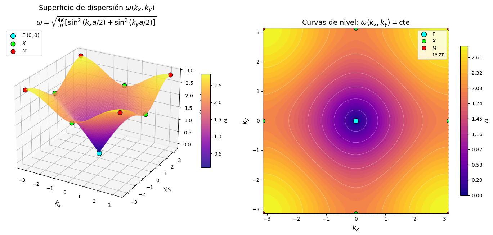

# Numerical Simulation of Phononic Modes and Density of States (DOS) in a 2D Crystal Lattice
I WILL INCLUDE A SUMMARY OF THE WORK, THE PROBLEM, THE RESULTS, AND THE CONCLUSIONS REACHED.

## Project Components
* **Theoretical Solution:** Analytical formulation of the vibration of a two-dimensional monoatomic lattice in the First Brillouin Zone.

* **Numerical Calculation:** Implementation in Python using NumPy and SciPy to solve eigenvalue problems in the First Brillouin Zone.

* **Data Visualization:** High-quality plots of the phononic branches and the numerical versus analytical DOS (Van Hove Singularities) using Matplotlib.

---

## Theoretical Resolution
**Equation of Motion**
To find the equation of motion, we will use Newton's laws. Let $U_n(t)$ be the scalar longitudinal displacement. Considering the lattice in 2-D, there will be a displacement with a horizontal component $n_x$ and a vertical component $n_y$. Therefore, we will consider the neighbors (below, above, to the left, and to the right) of the atom at position $U_n$.
Since each atom interacts via a spring (an interpretation of a reciprocal lattice), each atom exerts a restoring force and a buoyant force, as described by Hooke's Law.

$$F = -K \Delta X$$

Given the forces that arise during a 2-D network vibration, we can use
$$\sum F = ma$$  

where, by equating using Newton's third law, we can find the total forces of the 2D crystal lattice.

The equation of motion for a classical two-dimensional square lattice.
$$\sum F = m \frac{d^2 u_n}{dt^2} = K \left[ U_{n_x+1, n_y} - U_{n_x, n_y} + U_{n_x-1, n_y} - U_{n_x, n_y} + U_{n_x, n_y-1} - U_{n_x, n_y} + U_{n_x, n_y+1} - U_{n_x, n_y} \right]$$

**Since we are working with a periodic network, we can propose a Bloch wave as a solution:

$$ U_n(t) = A e^{i(\vec{k} \cdot \vec{R}_n - \omega t)}$$
where, by operating on the previously obtained equation of motion, we can find the dispersion relation. The dispersion relation for 2-D network vibration is defined as:

$$ \omega(k_{x}, k_{y}) = \sqrt{\frac{4K}{m} \left[ \sin^2\left(\frac{k_x a}{2}\right) + \sin^2\left(\frac{k_y a}{2}\right) \right]}$$

Dispersión en la primera zona de Brillouin
Basándonos en el caso de 1-D, la primera Zona de Brillouin sería $-\frac{\pi}{a} < k \leq \frac{\pi}{a}$, lo cual para el caso de 2-D $k_x$ y $k_y$ tenemos en

$$  -\frac{\pi}{a} < k_x \leq \frac{\pi}{a} \quad , \quad -\frac{\pi}{a} < k_y \leq \frac{\pi}{a}$$

es coherente ya que esta red es cuadrada en el espacio recíproco.

**puntos de alta simetría $$\Gamma$,X,M$$, donde ahora vamos a Calcularlos; estos símbolos nos permiten entender qué valores toman
$k_x,k_y$*
-----
## Results and Graphs
Results from the Python code left in the src folder.

### 1. Phononic Dispersion Ratio
*(Insert your energy/frequency band graph here)*

### 2. Numerical Density of States (DOS)
*(Insert your DOS histogram or curve graph here, ideally showing singularities)*

---

## Libraries Used in Python

* **Python 3.x** - Main development language.

* **NumPy** - For constructing meshes in reciprocal space and efficient matrix operations.

* **SciPy** - Used for mathematical diagonalization and integration algorithms.

* **Matplotlib & Seaborn** - For generating publication-ready scientific plots.

* **LaTeX** - Used for writing the detailed project report.

-------------

## 📁 Repository Structure
* `/src`: Contains the Python scripts (`simulacion_red.py` or Jupyter Notebooks).

* `/assets`: Images and graphics used in this presentation file.

---------------------

## 🔧 How to Run the Simulation

1. Clone this repository:

``bash
   git clone [https://github.com/TU_USUARIO/red-bidimensional-fonones.git](https://github.com/TU_USUARIO/red-bidimensional-fonones.git)
